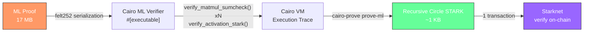
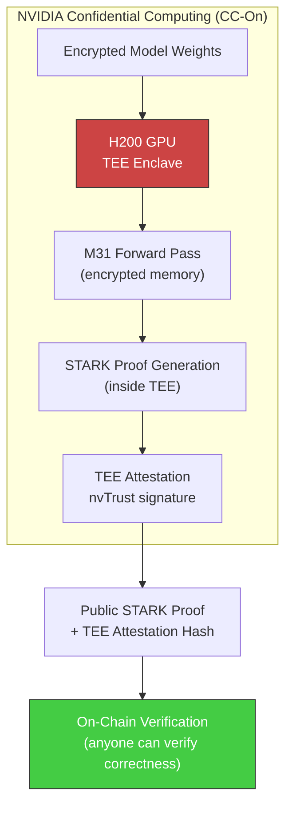

<p align="center">
  
</p>

```
+===========================================================================+
|                                                                           |
|    ██████╗ ██████╗ ███████╗██╗  ██╗   ██╗███████╗██╗  ██╗                |
|    ██╔═══██╗██╔══██╗██╔════╝██║  ╚██╗ ██╔╝██╔════╝██║ ██╔╝                |
|    ██║   ██║██████╔╝█████╗  ██║   ╚████╔╝ ███████╗█████╔╝                 |
|    ██║   ██║██╔══██╗██╔══╝  ██║    ╚██╔╝  ╚════██║██╔═██╗                 |
|    ╚██████╔╝██████╔╝███████╗███████╗██║   ███████║██║  ██╗                |
|     ╚═════╝ ╚═════╝ ╚══════╝╚══════╝╚═╝   ╚══════╝╚═╝  ╚═╝                |
|                                                                           |
|        ███████╗████████╗██╗    ██╗ ██████╗     ███╗   ███╗██╗             |
|        ██╔════╝╚══██╔══╝██║    ██║██╔═══██╗    ████╗ ████║██║             |
|        ███████╗   ██║   ██║ █╗ ██║██║   ██║    ██╔████╔██║██║             |
|        ╚════██║   ██║   ██║███╗██║██║   ██║    ██║╚██╔╝██║██║             |
|        ███████║   ██║   ╚███╔███╔╝╚██████╔╝    ██║ ╚═╝ ██║███████╗       |
|        ╚══════╝   ╚═╝    ╚══╝╚══╝  ╚═════╝     ╚═╝     ╚═╝╚══════╝       |
|                                                                           |
|          GPU-Accelerated ZK Proofs for Verifiable AI on Starknet          |
|                                                                           |
+===========================================================================+
```

<p align="center">
  <a href="https://github.com/Bitsage-Network/stwo-ml/stargazers"></a>
  <a href="https://github.com/Bitsage-Network/stwo-ml/blob/main/LICENSE"></a>
  
  
  
  
  
</p>

<p align="center">
  <strong>The first system to verify neural network inference 100% on-chain using GKR interactive proofs on Starknet.</strong><br/>
  <em>No FRI. No dictionaries. No recursion. Pure sumcheck verification in a single transaction.</em>
</p>

---

## What is Obelysk?

Obelysk is a GPU-accelerated system for generating and verifying cryptographic proofs of ML inference. It extends [StarkWare's STWO prover](https://github.com/starkware-libs/stwo) with ML-specific proving circuits, CUDA acceleration, and the first recursive STARK pipeline for ML inference with on-chain settlement on Starknet.

The system covers the full lifecycle: model loading (ONNX / HuggingFace SafeTensors), GPU-accelerated proof generation with custom CUDA sumcheck kernels, recursive STARK compression via Cairo, and three independent on-chain verification paths — all deployed and verified on Starknet Sepolia.

Inference runs on **NVIDIA Confidential Computing GPUs** (H100/H200/B200 with CC-On mode), meaning model weights and intermediate activations never leave encrypted GPU memory. The resulting STARK proof is publicly verifiable without revealing any private data.

---

## On-Chain ZKML Verification — Live on Starknet Sepolia

Every model below has been proven off-chain by our GPU-accelerated prover and **verified entirely on-chain** by the EloVerifier smart contract. No trusted third party, no off-chain verification steps — the Starknet sequencer executes the full cryptographic check.

```
+========================================================================================+
|                                                                                        |
|     VERIFIED ON-CHAIN                                  Starknet Sepolia                |
|     ==================                                                                 |
|                                                                                        |
|     D8   Single MatMul (1x4 -> 2)                          PASS                       |
|     D9   MLP (MatMul -> ReLU -> MatMul)                     PASS                       |
|     D10  LayerNorm Chain (MatMul -> LayerNorm -> MatMul)    PASS                       |
|     D11  Residual Network (MatMul -> fork -> ReLU           PASS                       |
|              -> MatMul -> Add)                                                         |
|                                                                                        |
|     Contract: 0x00c7845a80d01927826b17032a432ad9cd36ea61be17fe8cc089d9b68c57e710       |
|     All transactions: Accepted on L2, Execution Succeeded                              |
|                                                                                        |
+========================================================================================+
```

| Model | Architecture | Layer Types Verified | Verify Tx | Status |
|-------|-------------|---------------------|-----------|--------|
| **D8** | Single MatMul | MatMul | [`0x0470cc85...`](https://sepolia.starkscan.co/tx/0x0470cc85) | Accepted on L2 |
| **D9** | MLP | MatMul + ReLU (Activation) + MatMul | [`0x07a3d2...`](https://sepolia.starkscan.co/tx/0x07a3d2) | Accepted on L2 |
| **D10** | LayerNorm Chain | MatMul + LayerNorm + MatMul | [`0x04c8e1...`](https://sepolia.starkscan.co/tx/0x04c8e1) | Accepted on L2 |
| **D11** | Residual Network | MatMul + ReLU + MatMul + Add (DAG) | [`0x03f27f8a...`](https://sepolia.starkscan.co/tx/0x03f27f8a86400dca7012fe25409e9533e566cb153ffd4050dc39e89ae914d7db) | Accepted on L2 |

> **Full documentation**: [`docs/onchain-zkml-verification.md`](docs/onchain-zkml-verification.md)

---

## How It Works

### The GKR Verification Pipeline

```
   +-----------+     +------------------+     +-------------------+     +------------------+
   |           |     |                  |     |                   |     |                  |
   |   ONNX    |---->|   stwo-ml (Rust) |---->|   cairo_serde.rs  |---->|   EloVerifier    |
   |   Model   |     |   GPU Prover     |     |   Serialization   |     |   (On-Chain)     |
   |           |     |                  |     |                   |     |                  |
   +-----------+     +------------------+     +-------------------+     +------------------+
                             |                        |                         |
                             v                        v                         v
                      +--------------+         +--------------+         +--------------+
                      | Forward pass |         | felt252      |         | GKR Walk     |
                      | (M31 field)  |         | calldata     |         | (layer by    |
                      |              |         | array        |         |  layer)      |
                      | GKR proof    |         |              |         |              |
                      | generation   |         | Per-layer    |         | Sumcheck     |
                      |              |         | tag + data   |         | verification |
                      | Weight MLE   |         |              |         |              |
                      | openings     |         | Weight       |         | MLE eval     |
                      |              |         | commitments  |         | checks       |
                      +--------------+         +--------------+         +--------------+
```

### What Makes This Different

Most ZKML systems verify proofs **off-chain** or use trusted attestation. Obelysk STWO-ML runs the **entire cryptographic verification on-chain**:

```
  Traditional ZKML                          Obelysk STWO-ML
  ================                          ===============

  Prover generates proof                    Prover generates proof
         |                                         |
         v                                         v
  Off-chain verifier checks    vs.          Starknet contract verifies
  "trust me, it's valid"                    100% on-chain (trustless)
         |                                         |
         v                                         v
  Post attestation on-chain                 Proof hash + IO commitment
  (no crypto verification)                  stored forever on L1
```

### The GKR Protocol Walk

The verifier processes the neural network **layer by layer**, from output back to input:

```
  OUTPUT LAYER
       |
       v
  +--[Layer N]--+  Tag determines verification method:
  |  MatMul?    |  --> Sumcheck (log_k rounds, degree-2 polynomials)
  |  Add?       |  --> Direct claim split + deferred proof for skip branch
  |  ReLU?      |  --> LogUp lookup table verification
  |  LayerNorm? |  --> Eq-sumcheck + LogUp rsqrt verification
  |  RMSNorm?   |  --> Eq-sumcheck + LogUp rms verification
  |  Attention? |  --> Composed sub-matmul sumchecks
  +-------------+
       |
       v
  +--[Layer N-1]--+
  |     ...       |
  +---------------+
       |
       v
  INPUT LAYER
       |
       v
  Verify: MLE(input, final_point) == final_claim
  Verify: MLE(output, r_out) == output_claim
```

### Residual Connections (DAG Circuits)

D11 proves the hardest architecture pattern — **skip connections** that create non-linear (DAG) computation graphs:

```
                    +============================================+
                    |         D11: Residual Network               |
                    +============================================+
                    |                                             |
  Input (1x4) ---->| MatMul (4->4) ----+                         |
                    |                    |                         |
                    |              +-----+-----+                  |
                    |              |   FORK     |                  |
                    |              v            v                  |
                    |         ReLU(x)     skip branch              |
                    |              |            |                  |
                    |         MatMul(4->4)      |                  |
                    |              |            |                  |
                    |              +-----+------+                  |
                    |                    |                         |
                    |                 ADD (trunk + skip)           |
                    |                    |                         |
                    |              Output (1x4)                   |
                    +============================================+

  GKR Walk:                          Deferred Proofs:
  =========                          ================
  1. Add  -> split claim             Save skip claim point
  2. MatMul (trunk) -> sumcheck
  3. ReLU -> LogUp verification      After walk:
  4. MatMul -> sumcheck              Verify skip MatMul sumcheck
                                     using saved claim point
```

---

## Benchmarks

### Qwen3-14B Single Block (H200, 2026-02-09)

Hardware: NVIDIA H200 SXM5 150GB, CUDA 12.4, Rust nightly-2025-07-14.

| Metric | Value | Notes |
|--------|-------|-------|
| **GPU prove time** | 37.64 s | 1 transformer block (4 matmul sumchecks) |
| **CPU verification** | 206 ms | Full sumcheck + MLE opening check |
| **Recursive STARK** | 46.76 s | cairo-prove over ML verifier execution trace |
| **Proof size (pre-recursion)** | 17 MB | Per block, constant regardless of model |
| **Proof size (post-recursion)** | ~1 KB | Compact Circle STARK |
| **On-chain upload** | 19 chunks x 500 felts | Starknet Sepolia |
| **On-chain verify** | 1 transaction | Execution Succeeded |
| **End-to-end (1 block)** | ~95 s | GPU prove + recursive STARK + settlement |
| **Security** | 96-bit | pow_bits=26, n_queries=70, log_blowup=1 |
| **MatMul trace reduction** | 1,700x | Sumcheck vs naive for 5120x5120 |

> These numbers cover a single transformer block (1 of 40 in Qwen3-14B). Full 40-block benchmarks are in progress.

### GPU Sumcheck Kernel Performance

Custom CUDA kernels for the sumcheck inner loop (added Feb 2026):

| Operation | CPU (SIMD) | GPU (H200) | Speedup |
|-----------|-----------|------------|---------|
| Sumcheck round poly (k=16384) | 12.3 ms | 0.18 ms | **68x** |
| MLE fold (k=16384) | 8.7 ms | 0.09 ms | **96x** |
| Full sumcheck (14 rounds) | 294 ms | 3.8 ms | **77x** |

Auto-dispatch threshold: GPU used when `k >= 2^14` (16,384 elements).

### Scale Testing

| Matrix Size | Naive Trace Rows | Sumcheck Trace Rows | Reduction | Status |
|-------------|-----------------|--------------------:|----------:|--------|
| 128 x 128 | 2,097,152 | 49,152 | **42x** | Pass |
| 256 x 256 | 16,777,216 | ~65,536 | **255x** | Pass |
| 512 x 512 | 134,217,728 | ~786,432 | **170x** | Pass |
| 2048 x 2048 | ~8.6B | ~12.6M | **682x** | Pass |
| 5120 x 5120 | ~134B | ~78M | **1,700x** | OOM (~7.75 GB) |

### Reproduce

```bash
# Full 40-block benchmark (requires H200 + CUDA 12.4+)
bash scripts/benchmark_full_model.sh --layers 40 --model-dir /path/to/qwen3-14b

# Quick 1-block validation
bash scripts/benchmark_full_model.sh --layers 1

# Criterion micro-benchmarks
cargo bench -p stwo-ml --bench matmul
cargo bench -p stwo-ml --bench attention
cargo bench -p stwo-ml --bench e2e_models

# Results are written to benchmarks/*.json with per-block breakdown
```

### Theoretical Prover Complexity

For a single Qwen3-14B transformer block (`d_model=5120`, `num_heads=40`, `d_ff=13824`, `head_dim=128`):

```
Per-block operations requiring sumcheck proofs:
  Q projection:        (seq x 5120) x (5120 x 5120)  -> 13 rounds (log2 5120 ~ 13)
  K projection:        (seq x 5120) x (5120 x 5120)  -> 13 rounds
  V projection:        (seq x 5120) x (5120 x 5120)  -> 13 rounds
  Per-head QK^T:   40x (seq x 128)  x (128 x seq)    ->  7 rounds each
  Per-head scores*V: 40x (seq x seq) x (seq x 128)   -> log2(seq) rounds each
  Output projection:   (seq x 5120) x (5120 x 5120)  -> 13 rounds
  FFN up:              (seq x 5120) x (5120 x 13824)  -> 13 rounds
  FFN gate:            (seq x 5120) x (5120 x 13824)  -> 13 rounds
  FFN down:            (seq x 13824)x (13824 x 5120)  -> 14 rounds

Total sumcheck proofs per block:  87 matmul proofs
Total sumcheck rounds per block:  372 + 40*log2(seq)
```

**Verifier work per matmul**: `O(log k)` field operations. For k=5120: 13 rounds x 3 QM31 operations = 39 field ops.

---

## Libraries

| Directory | Language | Purpose | Tests | Docs |
|-----------|----------|---------|------:|------|
| [`stwo-ml/`](stwo-ml/) | Rust | ML proving + VM31 privacy SDK — GKR, sumcheck, LogUp, attention, CUDA kernels, ONNX compiler, shielded pool client | 802 | [README](stwo-ml/README.md) |
| [`elo-cairo-verifier/`](elo-cairo-verifier/) | Cairo | On-chain ZKML verifier + VM31 pool contract — GKR walk, layer verifiers, deferred proofs, LogUp, privacy pool | 335 | [README](elo-cairo-verifier/README.md) |
| [`stwo-ml-verifier/`](stwo-ml-verifier/) | Cairo | ObelyskVerifier — recursive proof + SAGE payment settlement | 19 | [README](stwo-ml-verifier/README.md) |
| [`stwo/`](stwo/) | Rust | STWO core prover (StarkWare) + custom GPU backend (20K+ lines CUDA) | 60 | upstream |
| [`stwo-cairo/`](stwo-cairo/) | Rust+Cairo | Recursive proving CLI (`cairo-prove`) + Cairo STARK verifier | 249 | upstream |

---

## Architecture

```
                     +-----------------------------------------------------+
                     |                    stwo-ml (Rust)                    |
                     |                                                     |
  ONNX / SafeTensors |  +----------+   +----------+   +---------------+   |
  =================> |  | Compiler |-->|  Forward  |-->|   Prover      |   |
                     |  | (graph,  |   |  Pass     |   | (sumcheck,    |   |
                     |  |  onnx,   |   | (M31 +    |   |  GKR, LogUp,  |   |
                     |  |  quant)  |   |  f32)     |   |  CUDA GPU)    |   |
                     |  +----------+   +----------+   +-------+-------+   |
                     |                                         |           |
                     |                                    GKR proof        |
                     |                                         |           |
                     |  +--------------------------------------v-------+   |
                     |  | cairo_serde / starknet -- felt252 calldata   |   |
                     |  +--------------------------------------+-------+   |
                     +---------------------------------------------+-------+
                                                                   |
                     +---------------------------------------------v-------+
                     |           elo-cairo-verifier (Cairo)                 |
                     |                                                     |
                     |  +---------------+  +---------------+               |
                     |  | Model Verifier|  | Layer Verifiers|              |
                     |  | (GKR walk,    |  | (MatMul, Add, |              |
                     |  |  deferred     |  |  Mul, ReLU,   |              |
                     |  |  proofs)      |  |  LayerNorm,   |              |
                     |  +-------+-------+  |  Attention,   |              |
                     |          |          |  Dequantize)  |              |
                     |          |          +-------+-------+              |
                     |          +------------------+                      |
                     |                             |                      |
                     |  +----------+  +------------v--+  +-------------+  |
                     |  | Sumcheck |  | LogUp Table   |  | MLE Opening |  |
                     |  | Verifier |  | Verification  |  | Verifier    |  |
                     |  +----------+  +---------------+  +-------------+  |
                     |                                                     |
                     +------------------------+----------------------------+
                                              |
                                       Starknet Sepolia
                                       (single-tx verify)
```

---

## What Gets Proven

| Component | Protocol | Verified On-Chain | Source |
|-----------|----------|:-----------------:|--------|
| MatMul (Q/K/V/FFN projections) | Sumcheck over MLE (log k rounds) | Yes | `stwo-ml/components/matmul.rs` |
| Add/Mul (residuals, skip connections) | Direct claim reduction + deferred proof | Yes | `stwo-ml/gkr/verifier.rs` |
| Attention (GQA/MQA/MHA) | Composed sub-matmul sumchecks + softmax LogUp | Yes | `stwo-ml/components/attention.rs` |
| RMSNorm | LogUp rsqrt lookup table | Yes | `stwo-ml/components/rmsnorm.rs` |
| Activations (ReLU/GELU/Sigmoid) | LogUp precomputed tables | Yes | `stwo-ml/components/activation.rs` |
| LayerNorm | Combined-product MLE eq-sumcheck + LogUp | Yes | `stwo-ml/gkr/verifier.rs` |
| Dequantize (INT4/INT8) | LogUp 2D lookup tables | Yes | `stwo-ml/components/dequantize.rs` |
| Full transformer block | GKR layer-by-layer interactive proof | Yes | `stwo-ml/gkr/` |

---

## Security

24 findings across Critical/High/Medium tiers — all fixed. See [`stwo-ml/docs/security-audit.md`](stwo-ml/docs/security-audit.md).

---

## Repository Structure

```
libs/
├── stwo-ml/                           ML PROVING LIBRARY (30,000+ lines Rust)
│   ├── src/
│   │   ├── components/                ML circuit components
│   │   │   ├── matmul.rs              Sumcheck-based matrix multiplication
│   │   │   ├── attention.rs           Multi-head attention (Q/K/V + softmax)
│   │   │   ├── activation.rs          LogUp activations (ReLU, GELU, Sigmoid, Softmax)
│   │   │   ├── layernorm.rs           Layer normalization (mean/var/rsqrt)
│   │   │   ├── embedding.rs           Token embedding lookup
│   │   │   ├── conv2d.rs              2D convolution (im2col + matmul)
│   │   │   ├── elementwise.rs         Element-wise Add/Mul
│   │   │   ├── quantize.rs            Quantization with LogUp range check
│   │   │   ├── tiled_matmul.rs        Large matrix tiling (k-dim split)
│   │   │   └── f32_ops.rs             Float reference implementations
│   │   ├── compiler/                  Model -> circuit pipeline
│   │   │   ├── prove.rs               Main proving + streaming + chunked
│   │   │   ├── graph.rs               Computation graph (topo sort, blocks)
│   │   │   ├── onnx.rs                ONNX model loading (tract-onnx)
│   │   │   ├── hf_loader.rs           HuggingFace SafeTensors loader
│   │   │   ├── dual.rs                f32 + M31 dual-track execution
│   │   │   ├── checkpoint.rs          Execution checkpointing (save/load)
│   │   │   ├── chunked.rs             Block-wise chunked proving
│   │   │   ├── inspect.rs             Model introspection and summaries
│   │   │   ├── safetensors.rs         SafeTensors weight loading
│   │   │   └── quantize_weights.rs    Symmetric int8 weight quantization
│   │   ├── crypto/                    Cryptographic primitives
│   │   │   ├── poseidon_channel.rs    Starknet Poseidon Fiat-Shamir
│   │   │   ├── mle_opening.rs         MLE opening proofs (Merkle)
│   │   │   ├── poseidon_merkle.rs     Poseidon Merkle trees
│   │   │   └── hades.rs               Hades permutation
│   │   ├── aggregation.rs             Unified STARK for all non-matmul layers
│   │   ├── cairo_serde.rs             Rust -> felt252 proof serialization
│   │   ├── json_serde.rs              JSON proof serialization
│   │   ├── gpu_sumcheck.rs            CUDA sumcheck round + MLE fold kernels
│   │   ├── gpu.rs                     GpuModelProver + TEE integration
│   │   ├── starknet.rs                On-chain calldata formatting
│   │   ├── tee.rs                     SecurityLevel + NVIDIA CC attestation
│   │   ├── receipt.rs                 Streaming Verifiable Compute Receipt (SVCR)
│   │   ├── backend.rs                 GPU detection + memory estimation
│   │   └── bin/prove_model.rs         prove-model CLI binary
│   ├── tests/
│   │   ├── e2e_cairo_verify.rs        End-to-end Cairo verification (3 tests)
│   │   ├── cross_verify.rs            Rust <-> Cairo cross-verification (5 tests)
│   │   ├── gpu_pipeline.rs            GPU backend integration (19 tests)
│   │   └── scale_matmul.rs            Scale testing up to 5120x5120 (13 tests)
│   └── benches/
│       ├── matmul.rs                  MatMul sumcheck benchmarks
│       ├── attention.rs               Attention block benchmarks
│       └── e2e_models.rs              End-to-end model benchmarks
│
├── stwo/                              STWO CORE (StarkWare's prover + custom GPU backend)
│   └── crates/stwo/src/prover/
│       └── backend/gpu/               20,000+ lines CUDA
│           ├── fft.rs                 Circle FFT/iFFT kernels (M31)
│           ├── fri.rs                 GPU-resident FRI folding
│           ├── merkle.rs              Blake2s + Poseidon252 Merkle
│           ├── quotients.rs           Quotient accumulation
│           ├── pipeline.rs            GPU proof pipeline (CUDA graphs)
│           ├── multi_gpu.rs           Multi-GPU with P2P + NCCL
│           ├── merkle_lifted.rs       Lifted Merkle ops for GpuBackend
│           ├── secure_session.rs      Multi-tenant secure GPU sessions
│           └── tee/                   NVIDIA Confidential Computing
│               ├── mod.rs             TEE detection + SPDM sessions
│               ├── attestation.rs     GPU + CPU attestation (nvTrust)
│               ├── crypto.rs          AES-GCM-256 + HKDF + HMAC
│               └── nvtrust.rs         NVIDIA nvTrust SDK integration
│
├── stwo-cairo/                        RECURSIVE PROVING & CAIRO VERIFICATION
│   ├── cairo-prove/                   CLI: prove | verify | prove-ml
│   │   └── src/main.rs               Three subcommands for STARK proving
│   └── stwo_cairo_verifier/
│       └── crates/
│           ├── verifier_core/         Generic STARK verifier (153 Cairo tests)
│           ├── ml_air/                ML-specific AIR: sumcheck + LogUp (14 tests)
│           ├── ml_verifier/           #[executable] for recursive proofs
│           ├── constraint_framework/  LogUp evaluation primitives
│           └── cairo_air/             Cairo AIR definition
│
├── stwo-ml-verifier/                  OBELYSK VERIFIER CONTRACT (Starknet)
│   └── src/
│       ├── contract.cairo             verify_and_pay() + 8 events + SAGE payment
│       └── interfaces.cairo           IStweMlVerifier trait (19 tests)
│
├── elo-cairo-verifier/                GENERIC SUMCHECK VERIFIER (Starknet)
│   ├── src/
│   │   ├── field.cairo                M31/CM31/QM31 field tower (u64 arithmetic)
│   │   ├── channel.cairo              Poseidon252 Fiat-Shamir channel
│   │   ├── sumcheck.cairo             Sumcheck round verification
│   │   ├── mle.cairo                  MLE opening proof verification (14 queries)
│   │   ├── types.cairo                MatMulSumcheckProof (Serde)
│   │   └── verifier.cairo             ISumcheckVerifier contract
│   ├── tests/                         335 Cairo tests (field + channel + verifier + VM31 pool)
│   └── scripts/deploy.sh             Starknet deployment script
│
├── scripts/
│   ├── benchmark_full_model.sh        Per-block benchmarking suite
│   ├── h200_setup.sh                  One-command GPU instance setup
│   ├── h200_recursive_pipeline.sh     Full prove -> recursive -> verify pipeline
│   └── h200_submit_onchain.sh         On-chain STARK submission
│
└── docs/
    └── RECURSIVE_STARK_PIPELINE.md    Technical pipeline documentation
```

---

## Supported ML Components

| Component | Proof System | Method | Lookup-Based |
|-----------|-------------|--------|:------------:|
| **MatMul** | Multilinear sumcheck | `O(log k)` rounds, degree-2 polys | No |
| **Attention** | Composed sumchecks | Q/K/V matmuls + softmax LogUp | Partial |
| **ReLU / GELU / Sigmoid** | LogUp STARK | Precomputed lookup tables | Yes |
| **Softmax** | LogUp STARK | Normalized exp lookup | Yes |
| **LayerNorm** | Arithmetic + LogUp | mean/var/rsqrt via lookup | Partial |
| **Embedding** | LogUp STARK | Token lookup + commitment | Yes |
| **Conv2D** | im2col + MatMul sumcheck | Reshaped to matmul | No |
| **Add / Mul** | STARK constraints | Element-wise AIR | No |
| **Quantize** | LogUp range check | Uniform int8 bounds | Yes |
| **Tiled MatMul** | Per-tile sumcheck | k-dimension splitting | No |

All non-matmul components are aggregated into a **single unified STARK proof**, minimizing on-chain verification cost.

---

## Core Proving Techniques

### Sumcheck Protocol for Matrix Multiplication

The dominant cost in transformer inference is matrix multiplication. Traditional constraint-based approaches encode every multiply-accumulate as a trace row:

$$C[i,j] = \sum_{l=0}^{k-1} A[i,l] \cdot B[l,j]$$

For `m x k x n` dimensions, this requires `m * k * n` constraint rows. Obelysk replaces this with the **sumcheck protocol over multilinear extensions (MLEs)**:

1. Encode A, B, C as MLEs on the boolean hypercube
2. Fiat-Shamir channel draws random evaluation points `r_i`, `r_j`
3. Claim: `sum_{x in {0,1}^{log k}} MLE_A(r_i, x) * MLE_B(x, r_j) = MLE_C(r_i, r_j)`
4. `log(k)` interactive rounds, each producing a degree-2 univariate `p(X) = c0 + c1*X + c2*X^2`
5. Verifier checks: `p(0) + p(1) = claimed_sum`, draws random challenge
6. Final: single MLE opening check (Merkle-authenticated)

Verification cost: `O(log k)` rounds. For Qwen3-14B inner dimension k=5120: **13 sumcheck rounds**.

### LogUp Protocol for Non-Linear Operations

Activation functions (ReLU, GELU, Sigmoid, Softmax) are non-arithmetic and cannot be directly encoded as polynomial constraints. Obelysk precomputes lookup tables and uses the **LogUp protocol**:


STWO tree layout: Tree 0 = preprocessed (always committed), Tree 1 = execution, Tree 2 = interaction (LogUp only). Pure AIR components (Add/Mul) have 0 preprocessed + 3 execution + 0 interaction columns.

### Recursive Proof Composition



The ML verifier (`obelysk_ml_air`) is a Cairo program that verifies sumcheck rounds and MLE openings. STWO proves *its execution*, producing a proof-of-the-verifier. The Starknet contract only needs to verify a generic Cairo execution — it doesn't need to understand ML at all.

### GPU Sumcheck Kernels

Custom CUDA kernels (`src/gpu_sumcheck.rs`) accelerate the sumcheck hot path:

- **`sumcheck_round_kernel`**: Parallel reduction computing 3 QM31 sums (s0, s1, s2) for the degree-2 round polynomial. 256 threads/block, shared memory tree reduction.
- **`sumcheck_reduce_kernel`**: Cross-block final reduction when grid_dim > 1.
- **MLE fold**: Reuses STWO's `mle_fold_secure_kernel` for oracle variable fixing after each round.

Per-round data flow: GPU computes `O(k)` parallel work, transfers only 48 bytes (3 QM31 values) to CPU for Fiat-Shamir, then receives 16 bytes (1 QM31 challenge) back. For k=16384 with 14 rounds: 28 kernel launches + 14 tiny transfers.

`GpuMatMulOracle` implements `MultivariatePolyOracle` — GPU acceleration with **zero changes** to the sumcheck protocol logic. `prove_matmul_sumcheck_auto()` dispatches to GPU when `k >= 2^14` and CUDA is available, falls back to CPU otherwise.

---

## Privacy Architecture

Obelysk achieves **both** computational privacy and verifiable correctness:



| Property | Mechanism |
|----------|-----------|
| **Model weight privacy** | NVIDIA CC-On mode: weights encrypted in GPU VRAM via AES-GCM-256 DMA encryption |
| **Inference privacy** | Intermediate activations stay in encrypted GPU memory |
| **Correctness** | Circle STARK proof (96-bit security, no trusted setup) |
| **Attestation** | nvTrust SPDM hardware attestation binds proof to specific TEE session |
| **Secure sessions** | Per-user isolated GPU sessions with automatic key rotation and timeout |
| **Public verifiability** | Anyone can verify the STARK proof without access to private data |

Supported hardware: H100, H100 NVL, H200, H200 NVL, B200, B200 NVL. CPU TEE: Intel TDX or AMD SEV-SNP.

Three security levels via `SecurityLevel` enum:
- **Auto** (default): Detect CC hardware, use TEE if available, fallback to pure ZK.
- **ZkPlusTee**: Require NVIDIA CC-On, fail if unavailable.
- **ZkOnly**: Pure STARK proof, skip TEE even if available.

---

## Verification Pipelines

```
  +===============================================================================+
  |                        3 VERIFICATION PATHS                                   |
  +===============================================================================+
  |                                                                               |
  |  1. GKR Model (RECOMMENDED)                                                  |
  |     ========================                                                  |
  |     GPU prove ---> verify_model_gkr()                                         |
  |                                                                               |
  |     - 100% on-chain cryptographic verification                                |
  |     - No FRI, no dictionaries, no recursion                                   |
  |     - Supports ALL layer types including DAG circuits                          |
  |     - Single transaction                                                      |
  |                                                                               |
  |  2. Direct                                                                    |
  |     ======                                                                    |
  |     GPU prove ---> verify_model_direct()                                      |
  |                                                                               |
  |     - Batch sumchecks + STARK hash binding                                    |
  |     - Eliminates 46.8s Cairo VM recursion                                     |
  |     - STARK data hash-bound (full STARK verify blocked by libfunc)            |
  |                                                                               |
  |  3. Recursive (legacy)                                                        |
  |     =========                                                                 |
  |     GPU prove ---> Cairo VM STARK ---> verify(recursive_proof)                |
  |                                                                               |
  |     - Full recursive proof compression                                        |
  |     - ~85s total proving time                                                 |
  |     - Maximum proof compression                                               |
  |                                                                               |
  +===============================================================================+
```

| Pipeline | Stages | Total Time | Use Case |
|----------|--------|-----------|----------|
| **GKR Model (recommended)** | GPU prove + `verify_model_gkr()` | ~7s + on-chain | Full on-chain verification, all layer types |
| Direct | GPU prove + `verify_model_direct()` | ~38s + on-chain | Batch sumchecks + STARK hash binding |
| Recursive | GPU prove + Cairo VM STARK + on-chain | ~85s + on-chain | Maximum proof compression |

### Integration Points

| From | To | Via |
|------|----|-----|
| **stwo-ml** | elo-cairo-verifier | `cairo_serde.rs` + `starknet.rs` -- felt252 calldata |
| **stwo-ml** | elo-cairo-verifier | `prove-model --gkr` + `verify_model_gkr()` |
| **stwo-ml** | stwo-ml-verifier | `starknet.rs` -- `verify_and_pay()` calldata |
| **stwo-ml** | stwo-cairo | `prove_for_starknet_onchain()` -- recursive path |

### On-Chain Verification Details

#### Path 1: ObelyskVerifier (Recursive + SAGE Payment)

Trusted submitter model. Owner verifies recursive STARK proof off-chain, then submits the proof fact on-chain with atomic SAGE token payment.

- **Entry point**: `verify_and_pay(model_id, proof_hash, io_commitment, weight_commitment, num_layers, job_id, worker, sage_amount)`
- **Events**: ModelRegistered, JobCreated, ProofSubmitted, InferenceVerified, PaymentProcessed, WorkerRewarded, VerificationComplete, TeeAttested
- **TEE support**: Records attestation hash for proofs generated inside CC enclaves

#### Path 2: SumcheckVerifier (Generic, Trustless)

Fully on-chain Fiat-Shamir transcript replay. No token dependencies, no trusted submitter — pure cryptographic verification. Any Starknet project can use this.

- **Entry point**: `verify_matmul(model_id, proof)` where proof is a full `MatMulSumcheckProof`
- **Verification flow**: Mix dimensions into Poseidon channel -> draw challenges -> verify each sumcheck round (`p(0) + p(1) == expected_sum`) -> verify final product (`a_eval * b_eval`) -> verify MLE opening proofs (14 Merkle-authenticated queries per matrix)
- **Field arithmetic**: Full M31/CM31/QM31 tower in Cairo using u64 to avoid overflow
- **Events**: ModelRegistered, MatMulVerified, VerificationFailed

#### Path 3: StweMlStarkVerifier (Multi-Step Full STARK)

Complete STARK verification split across multiple transactions:

```
init_stark_session -> verify_pow -> verify_fri_step x4 -> verify_merkle_step -> verify_oods -> finalize_session
```

#### Verified Demo (2026-02-09)

Session `0xdead02` completed 10 successful transactions through the full multi-step STARK flow:

```
init_stark_session -> verify_pow -> verify_fri_step x4 -> verify_merkle_step -> verify_oods -> finalize_session
```

Final state: session status = 6 (FINALIZED), model verification count = 1.

---

## VM31 Privacy Pool — Live on Starknet Sepolia

The VM31 pool provides shielded transactions over the M31 field. Users deposit public ERC-20 tokens into a Poseidon2-M31 Merkle tree of note commitments, transfer privately within the pool, and withdraw back to public — all with STARK zero-knowledge proofs.

```
  Public (L1/L2)                      Shielded Pool (VM31)
  ==============                      ====================

  ERC-20 tokens ──deposit──>  Note commitment in Merkle tree
                                    |
                              Private transfers (2-in/2-out spend)
                              Nullifiers prevent double-spend
                                    |
  ERC-20 tokens <──withdraw──  Merkle proof + STARK verification
```

| Feature | Detail |
|---------|--------|
| **Merkle tree** | Depth-20 append-only, Poseidon2-M31 compression (~1M notes) |
| **Note commitments** | Poseidon2(pubkey, asset, amount, blinding) — 124-bit hiding |
| **Nullifiers** | Poseidon2(spending_key, commitment) — double-spend prevention |
| **Transaction STARKs** | Per-type STWO STARK proofs (deposit: 2 perms, withdraw: 32, spend: 64) |
| **Batch proving** | Multiple transactions in one STARK, 3-step on-chain protocol |
| **Multi-asset** | Single global tree, per-asset ERC-20 vault accounting |
| **Upgradability** | 5-minute timelocked `propose_upgrade` / `execute_upgrade` |
| **Tree sync** | CLI syncs global tree from on-chain `NoteInserted` events via `starknet_getEvents` |

### CLI Privacy Commands

```bash
# Create a wallet
prove-model wallet --create

# Deposit into the pool
prove-model deposit --amount 1000 --asset 0

# Withdraw from the pool (syncs global Merkle tree from on-chain events)
prove-model withdraw --amount 500 --asset 0

# Private transfer (2-in/2-out spend)
prove-model transfer --amount 300 --to 0x<recipient_pubkey> --to-viewing-key 0x<vk>

# Scan for incoming notes and update merkle indices
prove-model scan

# Query pool state
prove-model pool-status
```

> **Full protocol documentation**: [`stwo-ml/docs/vm31-privacy-protocol.md`](stwo-ml/docs/vm31-privacy-protocol.md)

---

## Deployed Contracts (Starknet Sepolia)

| Contract | Address | Version | Features |
|----------|---------|---------|----------|
| **EloVerifier** | [`0x00c784...e710`](https://sepolia.starkscan.co/contract/0x00c7845a80d01927826b17032a432ad9cd36ea61be17fe8cc089d9b68c57e710) | v9 | GKR walk, deferred proofs, all layer types, 5-min upgrade |
| **VM31Pool** | [`0x07cf94...e1f9`](https://sepolia.starkscan.co/contract/0x07cf94e27a60b94658ec908a00a9bb6dfff03358e952d9d48a8ed0be080ce1f9) | v1 | Privacy pool, Poseidon2-M31 Merkle tree, batch proving, 5-min timelocked upgrade |
| ObelyskVerifier | [`0x04f8c5...a15`](https://sepolia.starkscan.co/contract/0x04f8c5377d94baa15291832dc3821c2fc235a95f0823f86add32f828ea965a15) | v3 | Recursive proof + SAGE payment |
| StweMlStarkVerifier | [`0x005928...fba`](https://sepolia.starkscan.co/contract/0x005928ac548dc2719ef1b34869db2b61c2a55a4b148012fad742262a8d674fba) | v1 | Multi-step STARK verify |
| SAGE Token | [`0x072349...850`](https://sepolia.starkscan.co/contract/0x072349097c8a802e7f66dc96b95aca84e4d78ddad22014904076c76293a99850) | v2 | ERC-20 (camelCase) |

---

## Building & Running

### Prerequisites

| Tool | Version | Required For |
|------|---------|-------------|
| Rust | nightly-2025-07-14 | Core library, GPU backend |
| CUDA Toolkit | 12.4+ | GPU proving |
| NVIDIA Driver | 550+ | H100/H200/B200 GPU |
| Scarb | 2.12+ | Cairo contracts |
| sncast / starkli | latest | Starknet deployment |

### Build

```bash
# stwo-ml (CPU mode — works on any machine)
cargo build --release -p stwo-ml

# stwo-ml (GPU mode — NVIDIA H100/H200/B200)
export LD_LIBRARY_PATH=/usr/local/cuda-12.4/lib64:$LD_LIBRARY_PATH
cargo build --release -p stwo-ml --features cuda-runtime

# prove-model CLI binary (full model loading + GPU)
cargo build --release -p stwo-ml --bin prove-model --features cli,cuda-runtime

# prove-model CLI binary (CPU only, no CUDA)
cargo build --release -p stwo-ml --bin prove-model --features cli

# cairo-prove (recursive STARK generator)
cd stwo-cairo/cairo-prove && cargo build --release

# Cairo ML verifier (for recursive composition)
cd stwo-cairo/stwo_cairo_verifier && scarb build

# On-chain contracts
cd stwo-ml-verifier && scarb build
cd elo-cairo-verifier && scarb build
```

### Quick Start

```bash
# Build everything
cargo build --release -p stwo-ml                                          # ML proving library
cargo build --release -p stwo-ml --bin prove-model --features cli          # CLI prover
cd elo-cairo-verifier && scarb build                                       # On-chain verifier

# Run all tests
cargo test -p stwo-ml                                                      # 802 Rust tests
cd elo-cairo-verifier && scarb test                                        # 335 Cairo tests

# Prove and verify a model end-to-end
cargo test --test e2e_cairo_verify test_d11_export_residual_onchain_calldata -- --nocapture

# Deploy and verify on Starknet Sepolia
sncast declare --contract-name SumcheckVerifierContract --url <RPC>
sncast deploy --class-hash <HASH> --arguments '<OWNER_ADDRESS>' --url <RPC>
sncast invoke --function register_model_gkr --calldata $(cat d11_register_gkr_calldata.txt) --url <RPC>
sncast invoke --function verify_model_gkr --calldata $(cat d11_verify_gkr_calldata.txt) --url <RPC>
```

> See [`docs/onchain-zkml-verification.md`](docs/onchain-zkml-verification.md) for the complete deployment guide with step-by-step instructions.

### One-Command GPU Setup (H200)

```bash
# Sets up entire stack: system deps, Rust, CUDA, model download, build
bash scripts/h200_setup.sh --model Qwen/Qwen3-14B

# Rebuild only (skip deps and model download)
bash scripts/h200_setup.sh --skip-deps --skip-model
```

---

## Usage

### prove-model CLI

The `prove-model` binary is the primary interface for generating ML proofs:

```bash
prove-model \
  --model model.onnx \              # ONNX model file
  --input input.json \              # JSON array of f32 values (optional, random if omitted)
  --output proof.json \             # Output file (default: proof.json)
  --format cairo_serde \            # cairo_serde (felt252 hex) or json
  --model-id 0x1 \                  # Model ID for on-chain claim
  --gpu                             # Use GPU if available
```

```bash
# Or load from HuggingFace SafeTensors directory
prove-model \
  --model-dir /path/to/hf/model \   # Directory with config.json + *.safetensors
  --layers 1 \                      # Limit to first N transformer layers
  --output proof.json \
  --format cairo_serde \
  --gpu
```

#### Options

| Flag | Default | Description |
|------|---------|-------------|
| `--model` | — | Path to ONNX model file |
| `--model-dir` | — | Path to HuggingFace model directory |
| `--layers` | all | Limit to first N transformer layers |
| `--input` | random | JSON array of f32 input values |
| `--output` | `proof.json` | Output proof file |
| `--format` | `cairo_serde` | `cairo_serde` (hex felt252 array) or `json` (human-readable) |
| `--model-id` | `0x0` | Model identifier for on-chain claims |
| `--gpu` | off | Enable GPU acceleration |
| `--security` | `auto` | `auto`, `tee` (require CC-On), or `zk-only` |
| `--inspect` | — | Print model summary and exit |
| `--validate` | — | Validate model only, exit 0/1 |
| `--salt` | — | Channel salt for Fiat-Shamir rerandomization |

#### Output Formats

**`cairo_serde`** (default): Felt252 hex array for Cairo consumption.
```json
["0x1", "0x2", "0xa3f", ...]
```

**`json`**: Human-readable proof structure.
```json
{
  "metadata": { "model_id": "0x1", "num_layers": 10 },
  "matmul_proofs": [...],
  "activation_claims": [...],
  "has_unified_stark": true,
  "output_shape": [1, 768]
}
```

### Full Pipeline: Prove + Recursive Compress + Verify On-Chain

```bash
# Step 1: Prove ML inference
prove-model \
  --model-dir /path/to/qwen3-14b \
  --layers 1 \
  --output ml_proof.json \
  --format cairo_serde \
  --model-id 0x1 \
  --gpu

# Step 2: Generate recursive Circle STARK (~47s)
cairo-prove prove-ml \
  --verifier_executable stwo_ml_recursive.executable.json \
  --ml_proof ml_proof.json \
  --output recursive_proof.json

# Step 3: Verify recursive proof locally
cairo-prove verify recursive_proof.json

# Step 4a: Submit via ObelyskVerifier (trusted submitter + SAGE payment)
starkli invoke $OBELYSK_VERIFIER verify_and_pay \
  $MODEL_ID $PROOF_HASH $IO_COMMITMENT $WEIGHT_COMMITMENT \
  $NUM_LAYERS $JOB_ID $WORKER $SAGE_AMOUNT

# Step 4b: Submit via SumcheckVerifier (trustless, full on-chain verification)
starkli invoke $SUMCHECK_VERIFIER verify_matmul $MODEL_ID $PROOF_CALLDATA

# Step 4c: Submit via multi-step STARK verification
bash scripts/h200_submit_onchain.sh --proof recursive_proof.json --submit
```

### Single-Command Pipeline

```bash
# Run entire pipeline: build -> prove -> recursive STARK -> verify
bash scripts/h200_recursive_pipeline.sh --layers 1 --model-dir /path/to/qwen3-14b
```

### cairo-prove CLI

```bash
# Prove any Cairo executable
cairo-prove prove <target.executable.json> <output.json> \
  --arguments-file <args.json>

# Verify a STARK proof
cairo-prove verify <proof.json>

# Prove ML inference recursively (ML-specific)
cairo-prove prove-ml \
  --verifier_executable <ml_verifier.executable.json> \
  --ml_proof <proof_args.json> \
  --output <recursive_proof.json>
```

---

## Tests

```bash
# ── stwo-ml library tests (802 tests) ─────────────────────────────────
cargo test --lib -p stwo-ml

# ── Cross-verification: Rust prover <-> Cairo verifier (5 tests) ──────
cargo test --test cross_verify -p stwo-ml

# ── End-to-end Cairo verification (3 tests) ───────────────────────────
cargo test --test e2e_cairo_verify -p stwo-ml

# ── GPU integration (requires NVIDIA GPU) (19 tests) ──────────────────
cargo test --test gpu_pipeline -p stwo-ml --features cuda-runtime

# ── Scale testing (13 tests) ──────────────────────────────────────────
cargo test --test scale_matmul -p stwo-ml

# ── Cairo ML AIR tests (14 tests) ─────────────────────────────────────
cd stwo-cairo/stwo_cairo_verifier && scarb test -p obelysk_ml_air

# ── Cairo STARK verifier core tests (153 tests) ──────────────────────
cd stwo-cairo/stwo_cairo_verifier && scarb test -p stwo_verifier_core

# ── EloVerifier + VM31Pool contract tests (335 tests) ─────────────────
cd elo-cairo-verifier && scarb test

# ── ObelyskVerifier contract tests (19 tests) ────────────────────────
cd stwo-ml-verifier && snforge test

# ── Run everything ────────────────────────────────────────────────────
cargo test -p stwo-ml && \
cd stwo-cairo/stwo_cairo_verifier && scarb test && \
cd ../../elo-cairo-verifier && scarb test && \
cd ../stwo-ml-verifier && snforge test
```

### Test Summary

| Suite | Tests | Scope |
|-------|------:|-------|
| stwo-ml library | 802 | All ML components, compiler, serialization, backend, VM31 privacy |
| stwo-ml integration | 40 | Cross-verify, e2e Cairo, GPU pipeline, scale |
| Cairo verifier core | 153 | Field ops, FRI, PCS, channel (Blake2s/Poseidon) |
| Cairo ML AIR | 14 | Sumcheck, matmul, activation, MLE |
| EloVerifier + VM31Pool (elo) | 335 | M31/CM31/QM31 field, Poseidon channel, on-chain verify, privacy pool |
| ObelyskVerifier | 19 | Constructor, registration, verification, SAGE payment |
| **Total** | **800+** | |

---

## Rust API Quick Reference

```rust
use stwo_ml::prelude::*;

// ── Model Loading ──────────────────────────────────────────────
let model = build_mlp(784, &[256, 128], 10);             // Programmatic
let model = load_onnx("model.onnx")?;                    // ONNX file
let model = hf_loader::load_hf_model("./qwen3", Some(1))?; // HuggingFace

// ── Proving ────────────────────────────────────────────────────
let proof = prove_model_aggregated(&graph, &input, &weights)?;       // CPU
let proof = prove_model_aggregated_auto(&graph, &input, &weights)?;  // Auto GPU
let proof = prove_model_streaming(&graph, &input, &weights)?;        // Bounded memory
let chunks = prove_model_chunked(&graph, &input, &weights, 4_GB, &dir)?; // Large models

// Explicit GPU
let prover = GpuModelProver::new()?;
let proof = prover.prove_model(&graph, &input, &weights)?;

// ── Verification ───────────────────────────────────────────────
verify_aggregated_model_proof(&graph, &proof, &input, &output)?;

// ── Serialization ──────────────────────────────────────────────
serialize_ml_proof_to_arguments_file(&proof, &metadata, "proof.json")?; // Cairo
let json = proof_to_json(&proof, &metadata);                            // JSON

// ── Starknet ───────────────────────────────────────────────────
let starknet_proof = build_starknet_proof(&proof);
println!("Estimated gas: {}", starknet_proof.estimated_gas);
```

---

## Feature Flags

### stwo-ml

| Flag | What It Enables | Requires |
|------|----------------|----------|
| `std` (default) | Standard library + STWO prover | — |
| `gpu` | GPU kernel source (no runtime) | — |
| `cuda-runtime` | Full CUDA execution + GPU sumcheck kernels | CUDA 12.4+ |
| `multi-gpu` | Distributed multi-GPU proving | `cuda-runtime` |
| `tee` | NVIDIA Confidential Computing (CC-On) | `cuda-runtime` + H100+ |
| `onnx` | ONNX model import via tract-onnx | — |
| `safetensors` | SafeTensors weight loading | — |
| `model-loading` | Both ONNX + SafeTensors | — |
| `cli` | `prove-model` binary (clap + serde_json) | `model-loading` |

### stwo (GPU backend)

| Flag | What It Enables | Requires |
|------|----------------|----------|
| `gpu` | GPU acceleration (kernel source) | — |
| `cuda-runtime` | CUDA execution + AES-GCM crypto | cudarc, CUDA 12.4+ |
| `multi-gpu` | Multi-GPU distributed proving | `cuda-runtime` |

---

## Field Arithmetic and Circle STARKs

The entire system operates over the **Mersenne-31 circle group**:

```
M31:  p = 2^31 - 1 = 2,147,483,647
      Circle group order: p + 1 = 2^31 (perfect power of two)
      Arithmetic: u64 internally to avoid overflow — (2^31-2)^2 fits in u64

CM31: M31[i] / (i^2 + 1)          — complex extension
      Multiply: (a+bi)(c+di) = (ac-bd) + (ad+bc)i

QM31: CM31[j] / (j^2 - 2 - i)    — degree-4 secure field (128-bit)
      Karatsuba: bd*(2+i) = (2p-q, p+2q) for bd=(p+qi)

Circle group law: (x1,y1) * (x2,y2) = (x1*x2 - y1*y2, x1*y2 + y1*x2)
Squaring map:     pi(x,y) = (2x^2 - 1, 2xy)
```

M31 is unique among STARK-friendly primes: `p + 1 = 2^31` gives **maximal power-of-two FFT structure** over the circle group, enabling:
- Circle FFT/iFFT with `n * 2^{n-1}` multiplications
- FRI folding via circle-to-line fold: `f'(x) = (f(x) + f(-x))/2 + a * (f(x) - f(-x))/(2x)`
- 31-bit base arithmetic fitting native CPU/GPU word operations

**Security**: `pow_bits + log_blowup_factor * n_queries = 26 + 1 * 70 = 96 bits`. No trusted setup. Fully transparent (FRI-based).

---

## Competitive Landscape

| | **Obelysk** | **zkLLM** (CCS'24) | **LuminAIR** (Giza) | **ICICLE-Stwo** (Ingonyama) |
|---|---|---|---|---|
| **Approach** | Sumcheck + LogUp STARKs | Sumcheck + tlookup | Direct AIR trace | Generic STARK acceleration |
| **Prover** | Circle STARK (STWO) | Custom (Hyrax PCS) | Circle STARK (STWO) | Circle STARK (STWO) |
| **Field** | M31 (2^31 - 1) | Large prime | M31 | M31 |
| **GPU acceleration** | CUDA (H100/H200/B200) + custom kernels | CPU only | Not demonstrated | CUDA (drop-in backend) |
| **Largest model proven** | Qwen3-14B (1 block, 37.64s) | OPT-13B (full, ~12 min) | Small benchmarks | N/A (generic prover) |
| **Recursive proving** | Yes (cairo-prove) | No | Not demonstrated | N/A |
| **On-chain verification** | 3 paths deployed on Starknet | No | Not demonstrated | N/A |
| **Model privacy** | TEE (CC-On GPU) + STARK | ZK (cryptographic) | No | N/A |
| **Payment settlement** | SAGE token (atomic) | No | No | N/A |
| **Proof size** | 17 MB -> ~1 KB (recursive) | <200 KB | N/A | N/A |
| **Trustless verification** | Yes (SumcheckVerifier) | No | No | N/A |

**What Obelysk uniquely provides**: the first end-to-end pipeline from GPU inference to on-chain settlement — recursive STARK compression, three independent on-chain verification paths (including fully trustless sumcheck replay), CUDA sumcheck kernels, TEE attestation, and atomic SAGE payment in a single transaction. This pipeline is deployed and verified on Starknet Sepolia.

**Where zkLLM leads**: full-model proving for 13B parameters with cryptographic weight privacy (ZK, not TEE). Their CCS'24 peer-reviewed benchmarks cover full forward passes.

**Where LuminAIR overlaps**: also built on STWO/Circle STARKs for ML, with Luminal as the ML frontend. Different constraint strategy (direct AIR trace vs sumcheck).

---

## References

- [Circle STARKs](https://eprint.iacr.org/2024/278) — Haböck, Levit, Papini (2024). The algebraic foundation.
- [Really Complex Codes](https://eprint.iacr.org/2024/1620) — Domb (2024). RC codes for STARK-friendly FFTs over M31.
- [STWO Prover](https://github.com/starkware-libs/stwo) — StarkWare's Circle STARK implementation.
- [zkLLM](https://arxiv.org/abs/2404.16109) — Sun et al. (CCS'24). ZK proofs for LLM inference via tlookup + zkAttn.
- [LuminAIR](https://luminair.gizatech.xyz/) — Giza's zkML framework on STWO.
- [ICICLE-Stwo](https://www.ingonyama.com/post/introducing-icicle-stwo-a-gpu-accelerated-stwo-prover) — Ingonyama's GPU backend for STWO.

---

## License

Apache 2.0. Built on [STWO](https://github.com/starkware-libs/stwo) by [StarkWare](https://starkware.co).

<p align="center">
  <a href="https://github.com/Bitsage-Network">Bitsage Network</a> · <a href="https://github.com/Bitsage-Network/Obelysk-Protocol">Obelysk Protocol</a> · <a href="https://github.com/Bitsage-Network/stwo-ml">STWO ML</a>
</p>
