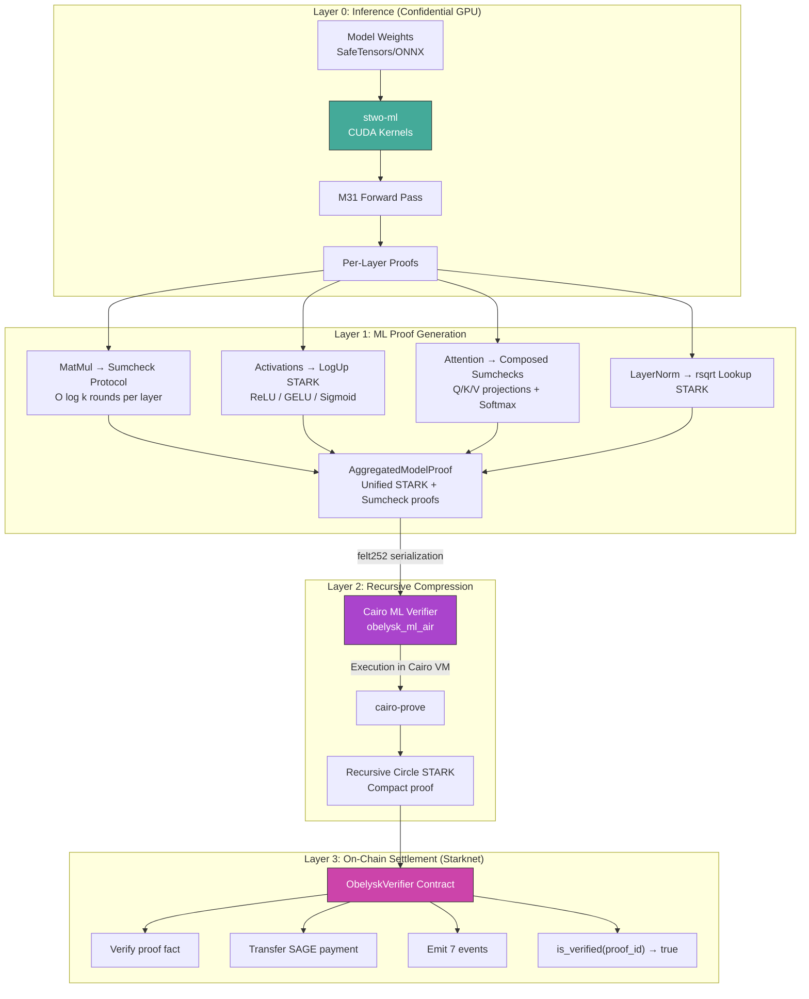

<p align="center">
  
</p>

```
╔═══════════════════════════════════════════════════════════════════════════════╗
║                                                                               ║
║    ██████╗ ██████╗ ███████╗██╗  ██╗   ██╗███████╗██╗  ██╗                    ║
║    ██╔═══██╗██╔══██╗██╔════╝██║  ╚██╗ ██╔╝██╔════╝██║ ██╔╝                    ║
║    ██║   ██║██████╔╝█████╗  ██║   ╚████╔╝ ███████╗█████╔╝                     ║
║    ██║   ██║██╔══██╗██╔══╝  ██║    ╚██╔╝  ╚════██║██╔═██╗                     ║
║    ╚██████╔╝██████╔╝███████╗███████╗██║   ███████║██║  ██╗                    ║
║     ╚═════╝ ╚═════╝ ╚══════╝╚══════╝╚═╝   ╚══════╝╚═╝  ╚═╝                    ║
║                                                                               ║
║        ███████╗████████╗██╗    ██╗ ██████╗     ███╗   ███╗██╗                 ║
║        ██╔════╝╚══██╔══╝██║    ██║██╔═══██╗    ████╗ ████║██║                 ║
║        ███████╗   ██║   ██║ █╗ ██║██║   ██║    ██╔████╔██║██║                 ║
║        ╚════██║   ██║   ██║███╗██║██║   ██║    ██║╚██╔╝██║██║                 ║
║        ███████║   ██║   ╚███╔███╔╝╚██████╔╝    ██║ ╚═╝ ██║███████╗           ║
║        ╚══════╝   ╚═╝    ╚══╝╚══╝  ╚═════╝     ╚═╝     ╚═╝╚══════╝           ║
║                                                                               ║
║          GPU-Accelerated ZK Proofs for Verifiable AI on Starknet              ║
║                                                                               ║
╚═══════════════════════════════════════════════════════════════════════════════╝
```

<p align="center">
  <a href="https://github.com/Bitsage-Network/stwo-ml/stargazers"></a>
  <a href="https://github.com/Bitsage-Network/stwo-ml/blob/main/LICENSE"></a>
  
  
  
</p>

<p align="center">
  <strong>Recursive STARK proofs for neural network inference, settled on-chain in a single transaction.</strong>
</p>

---

## What is Obelysk?

Obelysk is a GPU-accelerated system for generating and verifying cryptographic proofs of ML inference. It extends [StarkWare's STWO prover](https://github.com/starkware-libs/stwo) with ML-specific proving circuits, CUDA acceleration, and the first recursive STARK pipeline for ML inference with on-chain settlement on Starknet.

Inference runs on **NVIDIA Confidential Computing GPUs** (H100/H200/B200 with CC-On mode), meaning model weights and intermediate activations never leave encrypted GPU memory. The resulting STARK proof is publicly verifiable without revealing any private data.

---

## Benchmarks

<!-- ┌─────────────────────────────────────────────────────────────────────┐ -->
<!-- │ BENCHMARK DATA SOURCE: scripts/benchmark_full_model.sh            │ -->
<!-- │ Run on H200 and paste the output JSON into benchmarks/            │ -->
<!-- │ Update this section with real numbers from the benchmark run.     │ -->
<!-- └─────────────────────────────────────────────────────────────────────┘ -->

### Preliminary: Single Block (2026-02-09)

Hardware: NVIDIA H200 SXM5 150GB, CUDA 12.4, Rust nightly.

| Metric | Value | Scope |
|--------|-------|-------|
| **GPU prove time** | 37.64s | 1 transformer block of Qwen3-14B |
| **Verification** | 206ms | CPU, full sumcheck + MLE check |
| **Recursive STARK** | 46.76s | cairo-prove over ML verifier execution trace |
| **Proof size** | 17 MB (pre-recursion) | Per block |
| **On-chain upload** | 19 chunks x 500 felts | Starknet Sepolia |
| **On-chain verify** | 1 transaction | Execution Succeeded |
| **End-to-end (1 block)** | ~95s | GPU prove + recursive STARK + settlement |
| **Security** | 96-bit | pow_bits=26, n_queries=70, log_blowup=1. No trusted setup. |

> These numbers cover a single transformer block (1 of 40 in Qwen3-14B). Full 40-block benchmarks are in progress — run `scripts/benchmark_full_model.sh --layers 40` to reproduce.

### Reproduce Benchmarks

```bash
# Full 40-block benchmark (requires H200 + CUDA 12.4+)
bash scripts/benchmark_full_model.sh --layers 40 --model-dir /path/to/qwen3-14b

# Quick 1-block validation
bash scripts/benchmark_full_model.sh --layers 1

# Results are written to benchmarks/*.json with per-block breakdown
```

### Theoretical Prover Complexity

For a single Qwen3-14B transformer block (`d_model=5120`, `num_heads=40`, `d_ff=13824`, `head_dim=128`):

```
Per-block operations requiring sumcheck proofs:
  Q projection:        (seq × 5120) × (5120 × 5120)  →  13 rounds (log₂ 5120 ≈ 13)
  K projection:        (seq × 5120) × (5120 × 5120)  →  13 rounds
  V projection:        (seq × 5120) × (5120 × 5120)  →  13 rounds
  Per-head QKᵀ:    40× (seq × 128)  × (128 × seq)    →   7 rounds each
  Per-head scores·V: 40× (seq × seq)  × (seq × 128)   →  log₂(seq) rounds each
  Output projection:   (seq × 5120) × (5120 × 5120)  →  13 rounds
  FFN up:              (seq × 5120) × (5120 × 13824)  →  13 rounds
  FFN gate:            (seq × 5120) × (5120 × 13824)  →  13 rounds
  FFN down:            (seq × 13824)× (13824× 5120)   →  14 rounds

Total sumcheck proofs per block:  3 + 40 + 40 + 1 + 3 = 87 matmul proofs
Total sumcheck rounds per block:  ~(4×13) + (40×7) + (40×log₂ seq) + 13 + (2×13) + 14
                                = 52 + 280 + 40·log₂(seq) + 40 = 372 + 40·log₂(seq)
```

**Prover work per sumcheck round**: `O(m + n + k)` MLE evaluations (2 folds + 3 polynomial evaluations at `t = 0, 1, 2`)

**Trace rows per matmul** (sumcheck vs naive):

$$\text{Naive: } m \cdot k \cdot n \quad \text{vs} \quad \text{Sumcheck: } m \cdot n + m \cdot k + k \cdot n$$

For `5120 × 5120 × 5120`: naive = 134B rows, sumcheck = 78.6M rows (**1,708× reduction**)

**Verifier**: `O(log k)` field operations per matmul. For k=5120: 13 rounds × 3 QM31 operations = 39 field ops.

---

## Architecture



Each layer preserves 96-bit security. If the ML proof is invalid, the Cairo verifier rejects it, its execution trace diverges, and the recursive STARK will not verify.

---

## Core Proving Techniques

### Sumcheck Protocol for Matrix Multiplication

The dominant cost in transformer inference is matrix multiplication. Traditional constraint-based approaches encode every multiply-accumulate as a trace row:

$$C[i,j] = \sum_{l=0}^{k-1} A[i,l] \cdot B[l,j]$$

For `m x k x n` dimensions, this requires `m * k * n` constraint rows. Obelysk replaces this with the **sumcheck protocol over multilinear extensions (MLEs)**:

1. Encode A, B, C as MLEs on the boolean hypercube
2. Fiat-Shamir channel draws random evaluation points `r_i`, `r_j`
3. Claim: `Σ_{x ∈ {0,1}^{log k}} MLE_A(r_i, x) · MLE_B(x, r_j) = MLE_C(r_i, r_j)`
4. `log(k)` interactive rounds, each producing a degree-2 univariate `p(X) = c₀ + c₁X + c₂X²`
5. Verifier checks: `p(0) + p(1) = claimed_sum`, draws random challenge
6. Final: single MLE opening check

| Matrix Size | Naive Trace Rows | Sumcheck Trace Rows | Reduction |
|-------------|-----------------|--------------------:|----------:|
| 128 x 128 | 2,097,152 | 49,152 | **42x** |
| 256 x 256 | 16,777,216 | ~65,536 | **255x** |
| 512 x 512 | 134,217,728 | ~786,432 | **170x** |
| 5120 x 5120 (LLM-scale) | ~134B | ~78M | **1,700x** |

Verification cost: `O(log k)` rounds. For Qwen3-14B inner dimension k=5120: **13 sumcheck rounds**.

### LogUp Protocol for Non-Linear Operations

Activation functions (ReLU, GELU, Sigmoid, Softmax) are non-arithmetic and cannot be directly encoded as polynomial constraints. Obelysk precomputes lookup tables and uses the **LogUp protocol**:


All activation layers are aggregated into a **single unified STARK proof**, minimizing on-chain verification cost.

### Recursive Proof Composition


The ML verifier (`obelysk_ml_air`) is a Cairo program that verifies sumcheck rounds and MLE openings. STWO proves *its execution*, producing a proof-of-the-verifier. The Starknet contract only needs to verify a generic Cairo execution — it doesn't need to understand ML at all.

---

## Privacy Architecture

Obelysk achieves **both** computational privacy and verifiable correctness:


| Property | Mechanism |
|----------|-----------|
| **Model weight privacy** | NVIDIA CC-On mode: weights encrypted in GPU VRAM, never exposed to host |
| **Inference privacy** | Intermediate activations stay in encrypted GPU memory |
| **Correctness** | Circle STARK proof (96-bit security, no trusted setup) |
| **Attestation** | nvTrust hardware attestation binds proof to specific TEE session |
| **Public verifiability** | Anyone can verify the STARK proof without access to private data |

This provides a strictly stronger guarantee than pure ZK approaches (which prove correctness but require the prover to have access to plaintext weights) or pure TEE approaches (which provide isolation but no mathematical proof of correct execution).

---

## Competitive Landscape

| | **Obelysk** | **zkLLM** (CCS'24) | **LuminAIR** (Giza) | **ICICLE-Stwo** (Ingonyama) |
|---|---|---|---|---|
| **Approach** | Sumcheck + LogUp STARKs | Sumcheck + tlookup | Direct AIR trace | Generic STARK acceleration |
| **Prover** | Circle STARK (STWO) | Custom (Hyrax PCS) | Circle STARK (STWO) | Circle STARK (STWO) |
| **Field** | M31 (2^31 - 1) | Large prime | M31 | M31 |
| **GPU acceleration** | CUDA (H100/H200/B200) | CPU only | Not demonstrated | CUDA (drop-in backend) |
| **Largest model proven** | Qwen3-14B (1 block, 37.64s) | OPT-13B (full, ~12 min) | Small benchmarks | N/A (generic prover) |
| **Recursive proving** | Yes (cairo-prove) | No | Not demonstrated | N/A |
| **On-chain verification** | Starknet (deployed, verified) | No | Not demonstrated | N/A |
| **Model privacy** | TEE (CC-On GPU) | ZK (cryptographic) | No | N/A |
| **Payment settlement** | SAGE token (atomic) | No | No | N/A |
| **Proof size** | 17 MB → ~1 KB (recursive) | <200 KB | N/A | N/A |

**What Obelysk uniquely provides**: the first end-to-end pipeline from GPU inference to on-chain settlement — recursive STARK compression, multi-step STARK verification, and atomic payment in a single Starknet transaction. This pipeline is deployed and verified on Starknet Sepolia.

**Where zkLLM leads**: full-model proving for 13B parameters with cryptographic weight privacy (ZK, not TEE). Their CCS'24 peer-reviewed benchmarks cover full forward passes.

**Where LuminAIR overlaps**: also built on STWO/Circle STARKs for ML, with Luminal as the ML frontend. Different constraint strategy (direct AIR trace vs sumcheck).

---

## Field Arithmetic and Circle STARKs

The entire system operates over the **Mersenne-31 circle group**:

```
M31:  p = 2³¹ - 1 = 2,147,483,647
      Circle group order: p + 1 = 2³¹ (perfect power of two)

CM31: M31[i] / (i² + 1)          — complex extension
QM31: CM31[u] / (u² - 2 - i)     — degree-4 secure field (128-bit)

Circle group law: (x₁,y₁) · (x₂,y₂) = (x₁x₂ - y₁y₂, x₁y₂ + y₁x₂)
Squaring map:     π(x,y) = (2x² - 1, 2xy)
```

M31 is unique among STARK-friendly primes: `p + 1 = 2^31` gives **maximal power-of-two FFT structure** over the circle group, enabling:
- Circle FFT/iFFT with `n · 2^{n-1}` multiplications
- FRI folding via circle-to-line fold: `f'(x) = (f(x) + f(-x))/2 + α · (f(x) - f(-x))/(2x)`
- 31-bit base arithmetic fitting native CPU/GPU word operations

**Security**: `pow_bits + log_blowup_factor × n_queries = 26 + 1 × 70 = 96 bits`. No trusted setup. Fully transparent (FRI-based).

---

## Repository Structure

```
libs/
├── stwo/                              STWO CORE (StarkWare's prover + our GPU backend)
│   └── crates/stwo/src/prover/
│       └── backend/gpu/               20,000+ lines CUDA
│           ├── fft.rs                 Circle FFT/iFFT kernels (M31)
│           ├── fri.rs                 GPU-resident FRI folding
│           ├── merkle.rs              Blake2s + Poseidon252 Merkle
│           ├── quotients.rs           Quotient accumulation
│           ├── pipeline.rs            GPU proof pipeline
│           ├── multi_gpu.rs           Multi-GPU with P2P
│           └── tee/                   NVIDIA Confidential Computing
│
├── stwo-ml/                           ML PROVING LIBRARY (11,000+ lines Rust)
│   └── src/
│       ├── components/                MatMul sumcheck, LogUp activations,
│       │                              attention, layernorm, embedding, conv2d
│       ├── compiler/                  ONNX → graph → prove → aggregate
│       ├── aggregation.rs             Unified STARK for all non-matmul layers
│       ├── cairo_serde.rs             Rust → felt252 bridge
│       └── gpu_sumcheck.rs            CUDA sumcheck round kernels
│
├── stwo-cairo/                        RECURSIVE PROVING & CAIRO VERIFICATION
│   ├── cairo-prove/                   CLI: prove | verify | prove-ml
│   └── stwo_cairo_verifier/
│       └── crates/
│           ├── ml_air/                ML-specific AIR (sumcheck + activation LogUp)
│           ├── ml_verifier/           #[executable] for recursive proofs
│           ├── verifier_core/         Generic STARK verifier (FRI, PCS, Merkle)
│           └── constraint_framework/  LogUp evaluation primitives
│
├── stwo-ml-verifier/                  ON-CHAIN CONTRACTS (Starknet)
│   └── src/contract.cairo             ObelyskVerifier: verify_and_pay()
│
└── docs/                              Technical documentation
```

---

## On-Chain Verification

Three verification paths with different trust/cost tradeoffs:


### Deployed Contracts (Starknet Sepolia)

| Contract | Address | Purpose |
|----------|---------|---------|
| **StweMlStarkVerifier** | [`0x005928...74fba`](https://sepolia.voyager.online/contract/0x005928ac548dc2719ef1b34869db2b61c2a55a4b148012fad742262a8d674fba) | Multi-step STARK verification |
| **StweMlVerifier v3** | [`0x04f8c5...a15`](https://sepolia.voyager.online/contract/0x04f8c5377d94baa15291832dc3821c2fc235a95f0823f86add32f828ea965a15) | Direct sumcheck verification |
| **ObelyskVerifier** | [`0x04f8c5...a15`](https://sepolia.voyager.online/contract/0x04f8c5377d94baa15291832dc3821c2fc235a95f0823f86add32f828ea965a15) | Recursive proof + SAGE payment |
| **SAGE Token** | [`0x07234...850`](https://sepolia.voyager.online/contract/0x072349097c8a802e7f66dc96b95aca84e4d78ddad22014904076c76293a99850) | ERC-20 payment settlement |

### Verified Demo (2026-02-09)

Session `0xdead02` completed 10 successful transactions through the full multi-step STARK flow:

```
init_stark_session → verify_pow → verify_fri_step ×4 → verify_merkle_step → verify_oods → finalize_session
```

Final state: session status = 6 (FINALIZED), model verification count = 1.

---

## Building & Running

### Prerequisites

| Tool | Version | Required For |
|------|---------|-------------|
| Rust | nightly (see each crate's `rust-toolchain.toml`) | Core library |
| CUDA Toolkit | 12.4+ | GPU proving |
| NVIDIA Driver | 550+ | H100/H200/B200 GPU |
| Scarb | 2.12+ | Cairo contracts |
| starkli | latest | Starknet deployment |

### Build

```bash
# ── stwo-ml (CPU mode — works on any machine) ────────────────────────
cargo build --release -p stwo-ml

# ── stwo-ml (GPU mode — NVIDIA H100/H200/B200) ──────────────────────
export LD_LIBRARY_PATH=/usr/local/cuda-12.4/lib64:$LD_LIBRARY_PATH
cargo build --release -p stwo-ml --features cuda-runtime,safetensors,onnx

# ── prove-model CLI binary ───────────────────────────────────────────
cargo build --release -p stwo-ml --bin prove-model --features cuda-runtime,safetensors,onnx

# ── cairo-prove (recursive STARK generator) ──────────────────────────
cd stwo-cairo/cairo-prove && cargo build --release

# ── Cairo ML verifier (for recursive composition) ────────────────────
cd stwo-cairo/stwo_cairo_verifier && scarb build

# ── On-chain contracts ───────────────────────────────────────────────
cd stwo-ml-verifier && scarb build
```

### Full Pipeline: Prove + Recursive Compress + Verify On-Chain

```bash
# Step 1: Prove ML inference on GPU
prove-model \
  --model qwen3-14b.onnx \
  --input input.json \
  --output ml_proof.json \
  --format cairo_serde \
  --model-id 0x1 \
  --gpu

# Step 2: Generate recursive Circle STARK (~47s)
cairo-prove prove-ml \
  --verifier-executable stwo_ml_recursive.executable.json \
  --ml-proof ml_proof.json \
  --output recursive_proof.json

# Step 3: Verify recursive proof locally
cairo-prove verify recursive_proof.json

# Step 4: Submit to Starknet
starkli invoke $OBELYSK_VERIFIER verify_and_pay \
  $MODEL_ID $PROOF_HASH $IO_COMMITMENT $WEIGHT_COMMITMENT \
  $NUM_LAYERS $JOB_ID $WORKER $SAGE_AMOUNT

# Step 4 (alternative): Full multi-step STARK verification on-chain
bash scripts/h200_submit_onchain.sh --proof recursive_proof.json
```

### Full-Pipeline Script (Single Command)

```bash
# Run entire pipeline: build → prove → recursive STARK → verify
bash scripts/h200_recursive_pipeline.sh --layers 40 --model-dir /path/to/qwen3-14b
```

### Tests

```bash
# Library tests (all components)
cargo test --lib -p stwo-ml

# Cairo verifier tests
cd stwo-cairo/stwo_cairo_verifier && scarb test -p obelysk_ml_air

# GPU integration (requires NVIDIA GPU)
cargo test --test gpu_pipeline -p stwo-ml --features cuda-runtime

# Cross-verification (Rust prover ↔ Cairo verifier roundtrip)
cargo test --test cross_verify -p stwo-ml --features cuda-runtime

# On-chain contract tests
cd stwo-ml-verifier && snforge test
```

---

## Feature Flags

| Flag | What It Enables | Requires |
|------|----------------|----------|
| `std` (default) | Standard library + STWO prover | — |
| `gpu` | GPU kernel source (no runtime) | — |
| `cuda-runtime` | Full CUDA execution | CUDA 12.4+ |
| `multi-gpu` | Distributed multi-GPU proving | `cuda-runtime` |
| `tee` | NVIDIA Confidential Computing | `cuda-runtime` + H100+ |
| `onnx` | ONNX model import via tract-onnx | — |
| `safetensors` | SafeTensors weight loading | — |

---

## References

- [Circle STARKs](https://eprint.iacr.org/2024/278) — Haböck, Levit, Papini (2024). The algebraic foundation.
- [Really Complex Codes](https://eprint.iacr.org/2024/1620) — Domb (2024). RC codes for STARK-friendly FFTs over M31.
- [STWO Prover](https://github.com/starkware-libs/stwo) — StarkWare's Circle STARK implementation.
- [zkLLM](https://arxiv.org/abs/2404.16109) — Sun et al. (CCS'24). ZK proofs for LLM inference via tlookup + zkAttn.
- [LuminAIR](https://luminair.gizatech.xyz/) — Giza's zkML framework on STWO.
- [ICICLE-Stwo](https://www.ingonyama.com/post/introducing-icicle-stwo-a-gpu-accelerated-stwo-prover) — Ingonyama's GPU backend for STWO (3.25-7x over SIMD).

---

## License

Apache-2.0. See [LICENSE](LICENSE).

Built on [STWO](https://github.com/starkware-libs/stwo) by [StarkWare](https://starkware.co).

<p align="center">
  <a href="https://github.com/Bitsage-Network">Bitsage Network</a> · <a href="https://github.com/Bitsage-Network/Obelysk-Protocol">Obelysk Protocol</a> · <a href="https://github.com/Bitsage-Network/stwo-ml">STWO ML</a>
</p>
